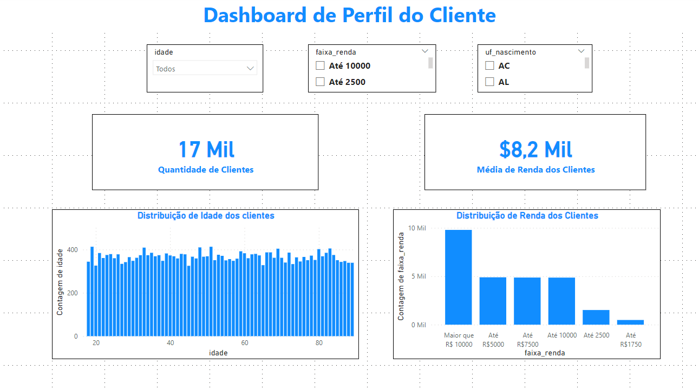
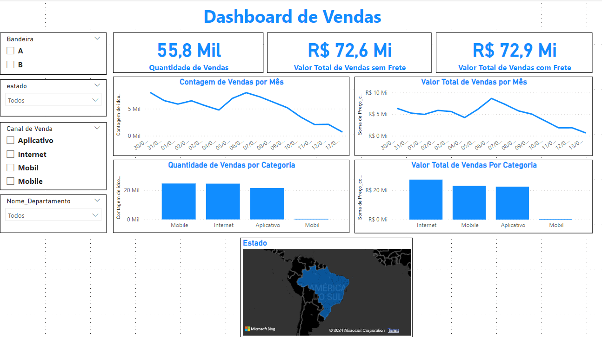

# Projeto de Regressão Linear para Previsão de Faturamento em um E-commerce

Este projeto foi realizado com o objetivo de enfrentar o desafio de construir um modelo de regressão linear capaz de prever os resultados de faturamento de um e-commerce. O projeto foi desenvolvido utilizando as ferramentas Power BI e Excel.

## Objetivos

- Coletar dados relevantes para a análise
- Preparar os dados para análise, realizando limpeza, remoção de valores ausentes.
- Explorar os dados utilizando técnicas de Análise Exploratória de Dados (AED) no Power BI e no Excel.
- Construir um modelo de regressão linear no Excel, utilizando a ferramenta de análise de dados.
- Visualizar os resultados da previsão utilizando o Power BI, criando gráficos que mostram as previsões em comparação com os valores reais de faturamento ao longo do tempo.
- Iterar e melhorar o modelo com base nos resultados da avaliação e nas necessidades do negócio.

## Resultados
Dashboards Clientes e Compra

